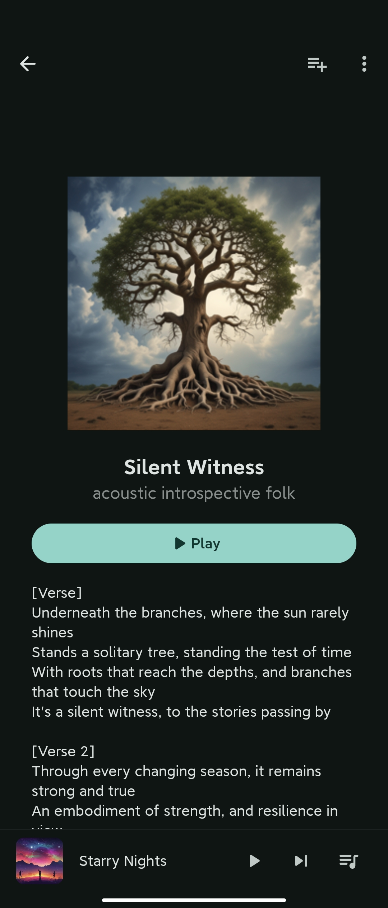
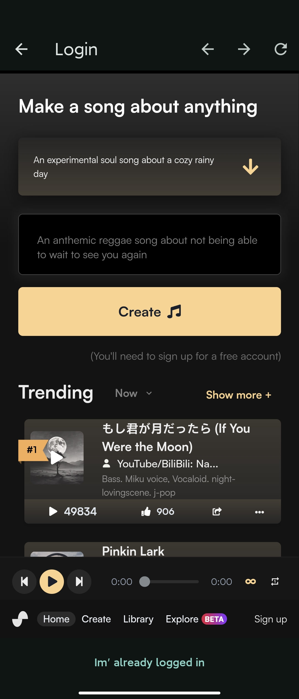

# SunoGenerator
a client for suno to use ai music generator

## Preview

## Login to suno ai

### For android and ios

use in app webview to login to suno ai,will read token and save

click login button to login

login to suno and click    `Im' already logined in` button

### For other platform

input cookie string to login

1. go to `https://app.suno.ai/`
2. login you account
3. open devtools,hit `F12` or `ctrl+shift+i`
4. refresh page
5. find request `https://clerk.suno.ai/v1/client?_clerk_js_version=4.70.5`
6. find `cookie` in request header

7. copy `cookie` string to input box

